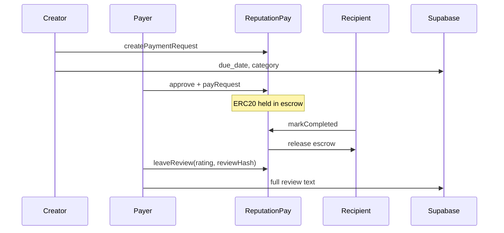

# Architecture

## High-level flow

## On-chain vs off-chain

| Data | Location |
|------|----------|
| Payment amount, escrow state | ReputationPay contract |
| Rating, reviewHash | ReputationPay contract |
| Full review text | Supabase or demo data |
| due_date, category | Supabase metadata |
| QIE Pass verified | Demo localStorage + profile mock |
| Reputation score | Client-side from getUserStats |

## Contracts

- **MockQIEUSD** — ERC20 demo stablecoin with public `mint`
- **ReputationPay** — escrow, release, refund, reputation stats

## Security

- `ReentrancyGuard` on pay, release, refund
- Custom Solidity errors
- One review per request; rating 1–5 only
- Refund only by payer after `refundDelay`
